# [📈 Live Status](https://uptime.kedi.dev): <!--live status--> **🟧 Partial outage**

This repository contains the open-source uptime monitor and status page for [Ananth](https://coredump.blog), powered by [Upptime](https://github.com/upptime/upptime).

With [Upptime](https://upptime.js.org), you can get your own unlimited and free uptime monitor and status page, powered entirely by a GitHub repository. We use [Issues](https://github.com/ananthb/uptime.kedi.dev/issues) as incident reports, [Actions](https://github.com/ananthb/uptime.kedi.dev/actions) as uptime monitors, and [Pages](https://uptime.kedi.dev) for the status page.

<!--start: status pages-->
<!-- This summary is generated by Upptime (https://github.com/upptime/upptime) -->
<!-- Do not edit this manually, your changes will be overwritten -->
<!-- prettier-ignore -->
| URL | Status | History | Response Time | Uptime |
| --- | ------ | ------- | ------------- | ------ |
|  [Immich](https://immich.kedi.dev) | 🟩 Up | [immich.yml](https://github.com/ananthb/uptime.kedi.dev/commits/HEAD/history/immich.yml) | 

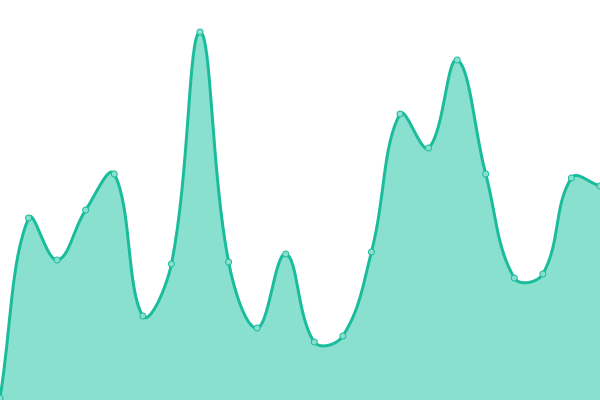 106ms
     
 | 

<a href="https://uptime.kedi.dev/history/immich">90.03%</a>
    

|  [Seafile](https://seafile.kedi.dev) | 🟩 Up | [seafile.yml](https://github.com/ananthb/uptime.kedi.dev/commits/HEAD/history/seafile.yml) | 

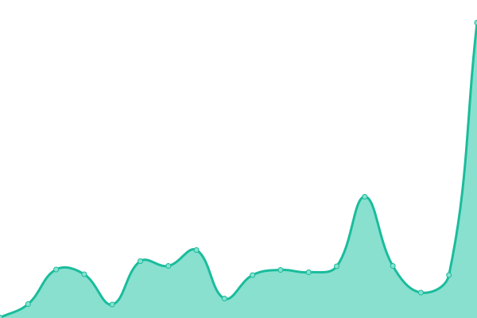 161ms
     
 | 

<a href="https://uptime.kedi.dev/history/seafile">97.57%</a>
    

|  [Jellyfin IPv6](https://tv.kedi.dev) | 🟩 Up | [jellyfin-i-pv6.yml](https://github.com/ananthb/uptime.kedi.dev/commits/HEAD/history/jellyfin-i-pv6.yml) | 

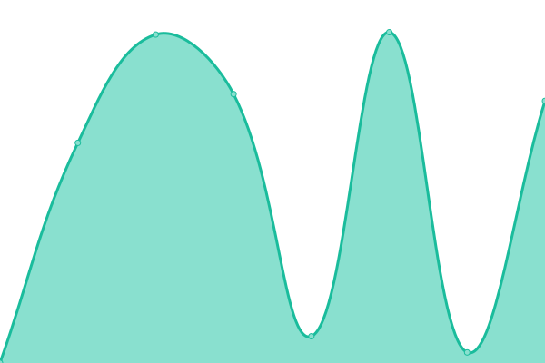 1327ms
     
 | 

<a href="https://uptime.kedi.dev/history/jellyfin-i-pv6">100.00%</a>
    

|  [Jellyfin](https://tv.tail42937.ts.net) | 🟩 Up | [jellyfin.yml](https://github.com/ananthb/uptime.kedi.dev/commits/HEAD/history/jellyfin.yml) | 

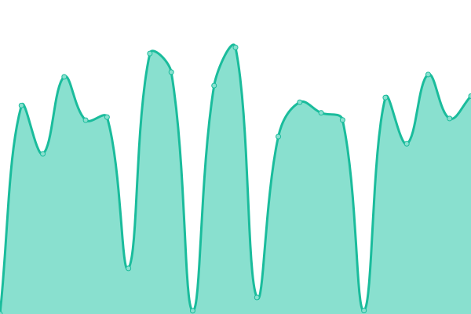 1411ms
     
 | 

<a href="https://uptime.kedi.dev/history/jellyfin">99.44%</a>
    

|  [Jellyseerr](https://seerr.kedi.dev) | 🟩 Up | [jellyseerr.yml](https://github.com/ananthb/uptime.kedi.dev/commits/HEAD/history/jellyseerr.yml) | 

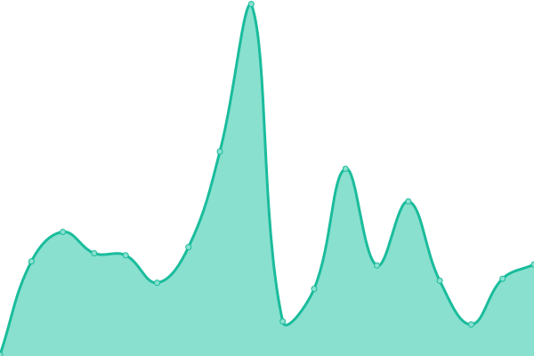 387ms
     
 | 

<a href="https://uptime.kedi.dev/history/jellyseerr">99.29%</a>
    

|  [Miniflux](https://miniflux.kedi.dev) | 🟩 Up | [miniflux.yml](https://github.com/ananthb/uptime.kedi.dev/commits/HEAD/history/miniflux.yml) | 

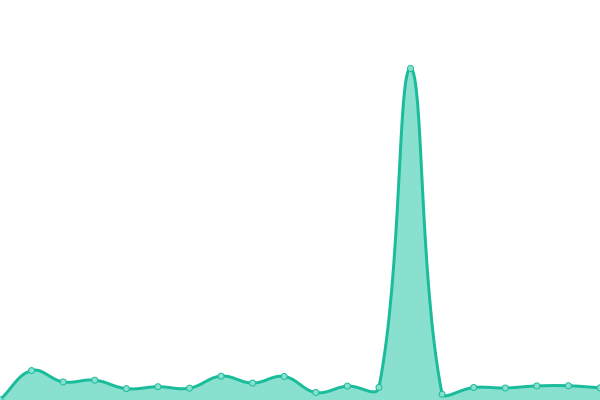 119ms
     
 | 

<a href="https://uptime.kedi.dev/history/miniflux">99.28%</a>
    

|  [Wallabag](https://wallabag.kedi.dev) | 🟥 Down | [wallabag.yml](https://github.com/ananthb/uptime.kedi.dev/commits/HEAD/history/wallabag.yml) | 

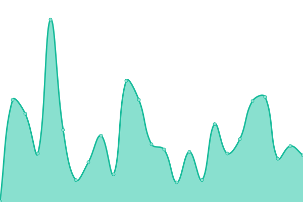 93ms
     
 | 

<a href="https://uptime.kedi.dev/history/wallabag">0.00%</a>
    

|  [6A](https://6a.kedi.dev) | 🟩 Up | [6-a.yml](https://github.com/ananthb/uptime.kedi.dev/commits/HEAD/history/6-a.yml) | 

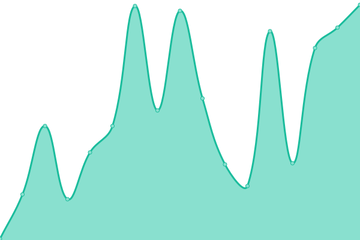 249ms
     
 | 

<a href="https://uptime.kedi.dev/history/6-a">99.28%</a>
    

|  [Actual Budget](https://actual.kedi.dev) | 🟩 Up | [actual-budget.yml](https://github.com/ananthb/uptime.kedi.dev/commits/HEAD/history/actual-budget.yml) | 

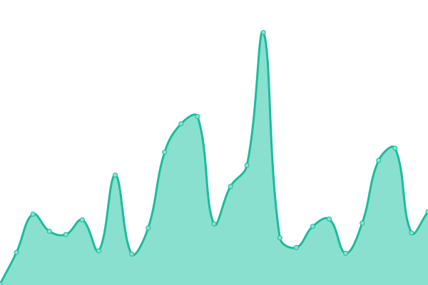 155ms
     
 | 

<a href="https://uptime.kedi.dev/history/actual-budget">98.73%</a>
    

|  [Vaultwarden](https://vault.kedi.dev) | 🟩 Up | [vaultwarden.yml](https://github.com/ananthb/uptime.kedi.dev/commits/HEAD/history/vaultwarden.yml) | 

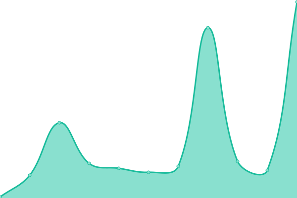 112ms
     
 | 

<a href="https://uptime.kedi.dev/history/vaultwarden">99.10%</a>
    

|  [Radicale](https://radicale.kedi.dev) | 🟩 Up | [radicale.yml](https://github.com/ananthb/uptime.kedi.dev/commits/HEAD/history/radicale.yml) | 

 109ms
     
 | 

<a href="https://uptime.kedi.dev/history/radicale">99.28%</a>
    

|  [Mealie](https://mealie.kedi.dev) | 🟥 Down | [mealie.yml](https://github.com/ananthb/uptime.kedi.dev/commits/HEAD/history/mealie.yml) | 

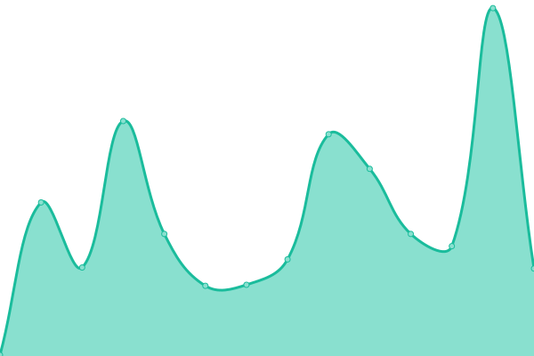 150ms
     
 | 

<a href="https://uptime.kedi.dev/history/mealie">93.75%</a>
    

<!--end: status pages-->

[**Visit our status website →**](https://uptime.kedi.dev)

## 📄 License

- Powered by: [Upptime](https://github.com/upptime/upptime)
- Code: [MIT](./LICENSE) © [Anand Chowdhary](https://anandchowdhary.com), supported by [Pabio](https://pabio.com)
- Data in the `./history` directory: [Open Database License](https://opendatacommons.org/licenses/odbl/1-0/)
